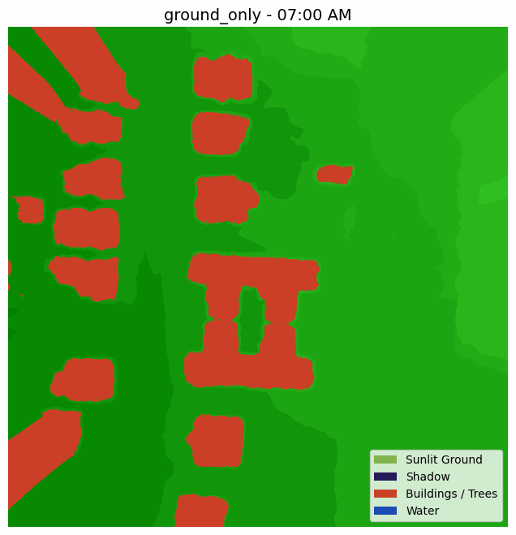
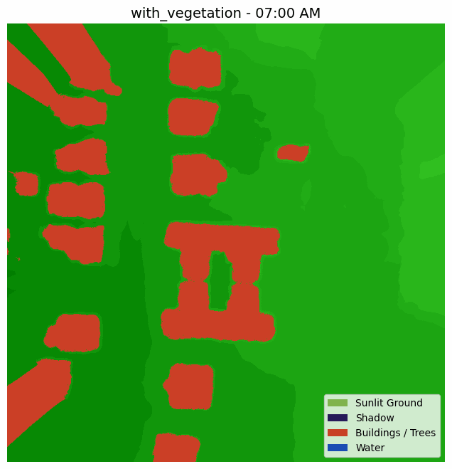

# SunDial




## Overview
The goal of this project is to create a publicly accessible, open-source API or Python library that can take in a longitude, latitude, and time of day, and predict if a point is in shade based on publicly available LiDAR scans. SunDial builds optimized DEMs from USGS LiDAR point clouds and performs GPU-free raytracing to cast accurate shadows using real solar positions.

---

## How It Works
1. **Download** — Fetches compressed LiDAR data (LAZ) from USGS for any location in Georgia
2. **Clip** — Extracts points within a configurable radius around the target coordinates
3. **Render DEM** — Builds a Digital Elevation Model via IDW interpolation at 0.25m resolution
4. **Fill Gaps** — Two-pass hole filling (Whitebox kernel + scipy nearest-neighbor)
5. **Raytrace Shadows** — For each pixel, traces a ray toward the sun using pvlib solar positions. If terrain blocks the ray, the pixel is marked as shadow
6. **Visualize** — Renders color-coded maps: green (sunlit), dark blue (shadow), red (buildings), blue (water)

The raytracer uses Numba JIT compilation with parallel execution for near-C performance.

---

## Features
- **Resolution-independent** shadow casting — works at any DEM pixel size
- **Bilinear interpolation** along rays for smooth shadow edges
- **Separate shadow mask** — elevation data stays clean, no corruption between pixels
- **Structure detection** — buildings identified by comparing full DEM to bare ground
- **Water detection** — ASPRS class 9 points rendered as blue
- **Timelapse GIFs** — generates shadow animations from sunrise to sunset in 15-minute steps
- **Dual output** — ground-only and with-vegetation shadow maps

---

## Requirements

- **whitebox** — LiDAR point cloud processing and terrain analysis
- **rioxarray** — Raster file processing with CRS support
- **rasterio** — Reading and writing geospatial raster data
- **earthpy** — Spatial data visualization
- **matplotlib** — Plotting and frame rendering
- **pyproj** — Coordinate transformations
- **laspy** — LiDAR point cloud reading (LAZ/LAS)
- **lazrs** — LAZ decompression backend for laspy
- **scipy** — Gap interpolation (griddata)
- **numpy** — Numerical operations
- **pvlib** — Solar position calculations
- **numba** — JIT compilation for raytracing performance
- **imageio** — GIF generation
- **pandas** — Timestamp handling
- **pytz** — Timezone support
- **ephem** — Sunrise/sunset calculations

---

## Installation

```bash
conda create -n sundial python=3.11
conda activate sundial
conda install -c conda-forge whitebox rioxarray rasterio earthpy matplotlib pyproj laspy lazrs-python scipy numpy pvlib numba imageio pandas pytz ephem geemap geopandas
```

*You may need to install packages one at a time if dependency resolution is slow.*

---

## Usage

Edit the latitude and longitude in `main()` inside `SunDial.py`, then run:

```bash
python SunDial.py
```

This will:
1. Download the LiDAR tile covering your coordinates
2. Render DEMs and cast shadows for each 15-minute interval from sunrise to sunset
3. Save timelapse GIFs to `output/gifs/YYYY-MM-DD/`

---

## ASPRS LAS Classification Codes

| Code | Description |
|------|-------------|
| 0 | Never classified |
| 1 | Unassigned |
| 2 | Ground |
| 3 | Low vegetation |
| 4 | Medium vegetation |
| 5 | High vegetation |
| 6 | Building |
| 7 | Low point (noise) |
| 9 | Water |
| 10 | Rail |
| 11 | Road surface |
